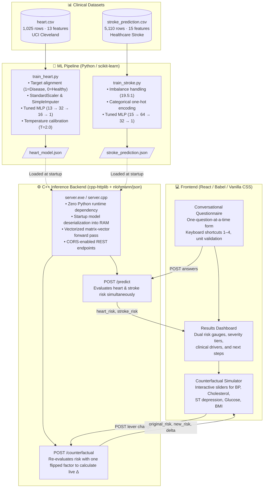

# MedflowAI 🫀🧠

> **High-Performance Clinical Decision Support System**  
> Real-time cardiovascular & stroke risk prediction with interactive counterfactual "what-if" simulation.

MedflowAI bridges modern deep learning and high-performance native systems. Offline machine learning models (trained in Python with scikit-learn) export neural network weights into flat, transparent JSON specifications. A lightweight **C++ inference engine** loads these models directly into memory to serve sub-millisecond risk evaluations and counterfactual what-if deltas over an HTTP REST API to a rich, patient-centric frontend.

---

## 🏗️ Architecture & Component Breakdown



---

## 🧩 Deep Dive: Each Element of the Application

### 1. The Machine Learning Engine (`train_heart.py` & `train_stroke.py`)
- **Heart Disease Model (`train_heart.py`)**:
  - **Dataset**: UCI Cleveland Heart Disease dataset (1,025 records with 13 physiological parameters).
  - **Label Alignment**: In the raw dataset, `target=0` corresponds to angiographic heart disease and `target=1` corresponds to healthy absence of disease. The pipeline explicitly aligns target orientation:
    $$\text{target} = (\text{target}_{\text{raw}} == 0) \implies 1 = \text{Disease (Risk)}, 0 = \text{Healthy}$$
  - **Architecture**: Multi-Layer Perceptron ($13 \rightarrow 32 \rightarrow 16 \rightarrow 1$) with ReLU activation in hidden layers and Sigmoid at the output.
  - **Temperature Calibration ($T = 2.0$)**: Softens raw logits before the sigmoid:
    $$P(\text{disease}) = \sigma\left(\frac{z}{T}\right) = \frac{1}{1 + e^{-z / T}}$$
    This preserves exact 94.6% classification accuracy and decision boundaries while eliminating saturated probabilities ($99.9999\%$ or $0.0001\%$), ensuring counterfactual sliders produce responsive, clinically sensible percentage point shifts.
  - **Output**: [`heart_model.json`](heart_model.json).

- **Stroke Prediction Model (`train_stroke.py`)**:
  - **Dataset**: Kaggle Healthcare Stroke dataset (5,110 patients across 15 clinical and demographic features).
  - **Class Imbalance**: Severe 19.5:1 negative-to-positive ratio addressed using balanced sample weights and tuning for Recall (80% sensitivity on stroke detection).
  - **Architecture**: Multi-Layer Perceptron ($15 \rightarrow 64 \rightarrow 32 \rightarrow 1$) with ReLU and Sigmoid output.
  - **Output**: [`stroke_prediction.json`](stroke_prediction.json).

---

### 2. The Native C++ Inference Server (`server.cpp`)
- **Header-Only Dependencies**: Built using [`cpp-httplib`](httplib.h) for cross-platform HTTP networking and [`nlohmann/json`](json.hpp) for fast JSON parsing.
- **In-Memory Model Representation**:
  ```cpp
  struct Layer {
      std::vector<std::vector<double>> W; // shape: [out][in]
      std::vector<double> b;              // shape: [out]
      std::string activation;             // "relu" or "sigmoid"
  };
  ```
- **Forward Pass (`run_mlp`)**:
  1. **StandardScaler**: $z_i = \frac{x_i - \mu_i}{\sigma_i}$
  2. **Hidden Layer 1**: $h_1 = \text{ReLU}(W_1 z + b_1)$
  3. **Hidden Layer 2**: $h_2 = \text{ReLU}(W_2 h_1 + b_2)$
  4. **Output Layer**: $p = \sigma(W_3 h_2 + b_3) = \frac{1}{1 + e^{-\text{logit}}}$
- **Latency**: Runs in **$< 1\text{ ms}$** per evaluation with no Python GIL, runtime interpreter, or heavy ML frameworks.

---

### 3. API Contract & Endpoints

#### `POST /predict`
Runs inference across both heart and stroke models simultaneously.
- **Request Body**:
  ```json
  {
    "features": {
      "age": 55, "sex": 1, "cp": 0, "trestbps": 130, "chol": 220,
      "fbs": 0, "restecg": 0, "thalach": 150, "exang": 1, "oldpeak": 2.8,
      "slope": 1, "ca": 3, "thal": 2, "gender": 1, "hypertension": 0,
      "heart_disease": 0, "ever_married": 1, "Residence_type": 1,
      "avg_glucose_level": 90, "bmi": 26, "work_type_Never_worked": 0,
      "work_type_Private": 1, "work_type_Self-employed": 0, "work_type_children": 0,
      "smoking_status_formerly smoked": 0, "smoking_status_never smoked": 1,
      "smoking_status_smokes": 0
    }
  }
  ```
- **Response**:
  ```json
  {
    "heart_risk": 0.9910,
    "stroke_risk": 0.3600
  }
  ```

#### `POST /counterfactual`
Re-runs a model with a single modified attribute while preserving all other patient values.
- **Request Body**:
  ```json
  {
    "features": { ... },
    "model": "heart",
    "flip_field": "oldpeak",
    "flip_value": 0.0
  }
  ```
- **Response**:
  ```json
  {
    "original_risk": 0.9910,
    "new_risk": 0.9601,
    "delta": -0.0309
  }
  ```

---

### 4. The Interactive User Interface (`frontend/medflowai.html`)
- **One-Question-at-a-Time Conversational Flow**:
  - Divided into 3 natural sections: *About You* (demographics), *Heart* (cardiac vitals & tests), and *Stroke* (lifestyle & metabolic markers).
  - Progressive input controls: number steppers with units (`mm Hg`, `mg/dl`, `bpm`, `mm`) and multi-choice buttons with keyboard shortcuts (`1`–`4`, `Enter`).
- **Feature Encoder & Safety Guards (`encoder.js`)**:
  - Automatically translates answers into the 27 flat features expected by the C++ models.
  - `REQUIRED_NONZERO` guard: Validates that continuous physiological parameters (`age`, `trestbps`, `chol`, `thalach`, `avg_glucose_level`, `bmi`) cannot be submitted as `0` due to skipped questions.
- **Results Dashboard**:
  - **Risk Gauges**: Visual percentage meters with dynamic color-coding:
    - 🟢 **Low Risk** ($< 33\%$)
    - 🟡 **Moderate Risk** ($33\% - 66\%$)
    - 🔴 **High Risk** ($> 66\%$)
  - **Clinical Drivers**: Surfaces the top clinical factors pushing the risk score (e.g. *"3 major vessels showed narrowing on fluoroscopy"*, *"ST depression of 2.8 mm during exertion"*).
  - **Actionable Next Steps**: Generates tailored clinical recommendations (e.g., lipid panel review, home BP tracking, smoking cessation advice).
- **Counterfactual Simulator ("What if one thing were different?")**:
  - Interactive slider controls for modifiable risk levers:
    - **Heart**: Cholesterol, Resting Blood Pressure, Peak Heart Rate, ST Depression.
    - **Stroke**: Average Glucose Level, BMI.
  - Immediate initialization on mount + debounced queries on slider dragging to show live point deltas:
    $$\Delta = \text{Risk}_{\text{modified}} - \text{Risk}_{\text{current}}$$
- **Graceful Fallback**: If the C++ server is unreachable, the frontend automatically falls back to an embedded mock evaluation with a topbar indicator.

---

## 🚀 Getting Started

### 1. Prerequisites
- **Python 3.9+** with `pandas`, `numpy`, and `scikit-learn`
- **C++ Compiler**: `g++` (MinGW on Windows / GCC on Linux) with C++17 support

```bash
pip install pandas numpy scikit-learn
```

### 2. Train the Models
Train both models to produce the standardized JSON configuration files:

```bash
# Train heart neural network -> produces heart_model.json
python train_heart.py

# Train stroke neural network -> produces stroke_prediction.json
python train_stroke.py
```

### 3. Build and Run the C++ Server
Compile the native inference server and start it on port 8080:

```powershell
# Compile with C++17 and optimization (Windows MinGW / GCC)
g++ -std=c++17 -O2 -o server.exe server.cpp -lws2_32

# Run the server
.\server.exe
```
*The server will start listening at `http://0.0.0.0:8080`.*

### 4. Launch the Web Application
Open [`frontend/medflowai.html`](frontend/medflowai.html) directly in any modern browser:

```powershell
Start-Process (Resolve-Path ".\frontend\medflowai.html").Path
```
The status pill in the top header will display **"Connected to inference server"** (in green).

---

## 🧪 Testing the Live System

You can test the running server endpoints directly via PowerShell or cURL:

```powershell
# Test Predict Endpoint
$body = '{"features":{"age":55,"sex":1,"cp":0,"trestbps":130,"chol":220,"fbs":0,"restecg":0,"thalach":150,"exang":1,"oldpeak":2.8,"slope":1,"ca":3,"thal":2,"gender":1,"hypertension":0,"heart_disease":0,"ever_married":1,"Residence_type":1,"avg_glucose_level":90,"bmi":26,"work_type_Never_worked":0,"work_type_Private":1,"work_type_Self-employed":0,"work_type_children":0,"smoking_status_formerly smoked":0,"smoking_status_never smoked":1,"smoking_status_smokes":0}}';
Invoke-WebRequest -Uri "http://localhost:8080/predict" -Method POST -ContentType "application/json" -Body $body | Select-Object -ExpandProperty Content

# Test Counterfactual Endpoint (Dropping ST depression from 2.8mm to 0.0mm)
$cf = '{"features":{"age":55,"sex":1,"cp":0,"trestbps":130,"chol":220,"fbs":0,"restecg":0,"thalach":150,"exang":1,"oldpeak":2.8,"slope":1,"ca":3,"thal":2,"gender":1,"hypertension":0,"heart_disease":0,"ever_married":1,"Residence_type":1,"avg_glucose_level":90,"bmi":26,"work_type_Never_worked":0,"work_type_Private":1,"work_type_Self-employed":0,"work_type_children":0,"smoking_status_formerly smoked":0,"smoking_status_never smoked":1,"smoking_status_smokes":0},"model":"heart","flip_field":"oldpeak","flip_value":0.0}';
Invoke-WebRequest -Uri "http://localhost:8080/counterfactual" -Method POST -ContentType "application/json" -Body $cf | Select-Object -ExpandProperty Content
```

---

## 📁 Repository Structure

```
ml_flow/
├── heart.csv                     # Raw UCI Heart Disease dataset
├── stroke_prediction.csv         # Raw Healthcare Stroke dataset
├── train_heart.py                # Python training & export for Heart Model
├── train_stroke.py               # Python training & export for Stroke Model
├── heart_model.json              # Trained MLP weights & scaler (Heart)
├── stroke_prediction.json        # Trained MLP weights & scaler (Stroke)
├── server.cpp                    # C++ inference engine & HTTP REST server
├── server.exe                    # Compiled C++ server executable
├── httplib.h                     # C++ header-only HTTP server library
├── json.hpp                      # C++ header-only JSON library
├── architecture.md               # Detailed architecture diagrams & specs
├── README.md                     # Complete project documentation
└── frontend/
    ├── medflowai.html            # Standalone all-in-one web application
    ├── src/                      # Modular React application source
    │   ├── App.jsx               # Root React application component
    │   ├── styles.css            # Custom CSS & design system tokens
    │   └── lib/
    │       ├── encoder.js        # Feature encoder & validation rules
    │       ├── risk.js           # Risk tiering, clinical drivers & next steps
    │       ├── questions.js      # Questionnaire flow & specifications
    │       └── api.js            # API client with timeout and mock fallback
    ├── package.json              # Optional Vite setup dependencies
    └── vite.config.js            # Vite bundler config
```
