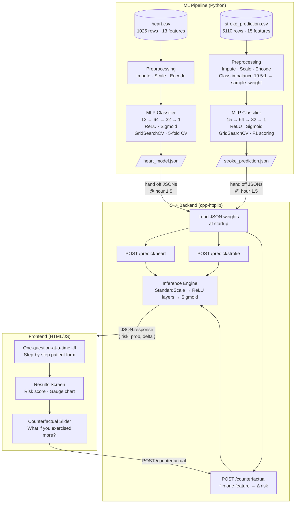

# MedflowAI 🫀🧠
> **CodeCortex Hackathon** — AI-powered cardiovascular & stroke risk prediction

MedflowAI is a full-stack clinical decision support system that predicts **heart disease** and **stroke risk** from patient vitals. A neural network backend (Python/sklearn) exports model weights as JSON, consumed by a high-performance **C++ inference server** that serves a real-time web frontend.

---

## System Architecture



---

## Inference Formula (C++ — identical for both models)

```
Given raw input vector x[0..n]:

Step 1  SCALE       z[i] = (x[i] - mean[i]) / scale[i]

Step 2  LAYER 0     pre  = W0 @ z + b0          (shape 64)
                    h0   = relu(pre)

Step 3  LAYER 1     pre  = W1 @ h0 + b1          (shape 32)
                    h1   = relu(pre)

Step 4  OUTPUT      logit = dot(W2, h1) + b2      (scalar)
                    prob  = 1 / (1 + exp(-logit))

Step 5  PREDICT     pred  = prob >= threshold      (0.5 default)
```

---

## Model Cards

### 🫀 Heart Disease Model
| Property | Value |
|---|---|
| Dataset | UCI Heart Disease (1,025 rows) |
| Features | 13 (age, sex, cp, trestbps, chol, fbs, restecg, thalach, exang, oldpeak, slope, ca, thal) |
| Architecture | `13 → 64 → 32 → 1` |
| Activation | ReLU (hidden) · Sigmoid (output) |
| Optimizer | Adam · lr=0.01 · α=0.01 |
| **Test Accuracy** | **96.1%** |
| Precision / Recall | 0.96 / 0.96 (both classes) |
| Export | `heart_model.json` |

### 🧠 Stroke Prediction Model
| Property | Value |
|---|---|
| Dataset | Kaggle Healthcare Stroke (5,110 rows) |
| Features | 15 (age, hypertension, heart_disease, glucose, BMI + encoded categoricals) |
| Class Imbalance | 19.5 : 1 (no-stroke : stroke) → fixed with sample_weight |
| Architecture | `15 → 64 → 32 → 1` |
| Activation | ReLU (hidden) · Sigmoid (output) |
| Tuning Metric | F1 (not accuracy — data is imbalanced) |
| **Stroke Recall** | **80%** (catches 4 in 5 real stroke cases) |
| Export | `stroke_prediction.json` |

---

## JSON Export Format

Both model JSON files share the **same schema** so Person B needs only one loader:

```json
{
  "model": "mlp_relu",
  "architecture": "13 -> 64 -> 32 -> 1",
  "decision_threshold": 0.5,
  "feature_names": ["age", "sex", ...],
  "scaler": {
    "type": "standard",
    "mean":  [54.6, 0.69, ...],
    "scale": [9.09, 0.46, ...]
  },
  "layers": [
    { "activation": "relu",    "W": [[...]], "b": [...] },
    { "activation": "relu",    "W": [[...]], "b": [...] },
    { "activation": "sigmoid", "W": [[...]], "b": 0.12  }
  ],
  "test_metrics": { "accuracy": 0.961 }
}
```

> `layers[i]["W"]` is stored as **(n_out × n_in)** — each row = one neuron's incoming weights.
> C++ dot: `for j in 0..n_out: out[j] = dot(W[j], input) + b[j]`

---

## Files

| File | Purpose |
|---|---|
| [`train_heart.py`](train_heart.py) | Full ML pipeline for heart disease |
| [`train_stroke.py`](train_stroke.py) | Full ML pipeline for stroke prediction |
| [`heart_model.json`](heart_model.json) | Exported weights — hand to Person B |
| [`stroke_prediction.json`](stroke_prediction.json) | Exported weights — hand to Person B |

---

## Quickstart

```bash
pip install pandas numpy scikit-learn

# Train heart model → outputs heart_model.json
python train_heart.py

# Train stroke model → outputs stroke_prediction.json
python train_stroke.py
```

> **Windows users:** run with `$env:PYTHONUTF8=1; python train_heart.py` to avoid Unicode console issues.

---

## Team Handoff Timeline

| Hour | Person A (ML) | Person B (C++) | Person C (Frontend) |
|---|---|---|---|
| 0–1.5 | Train models, export JSONs | Set up cpp-httplib skeleton | Build UI against mock JSON |
| 1.5 | **Hand off `heart_model.json` + `stroke_prediction.json`** | | |
| 1.5–2.5 | Done ✅ | Load JSONs, wire `/predict` endpoints | |
| 2.5–4 | | Add `/counterfactual`, CORS, debug | Swap mock → real endpoint |
