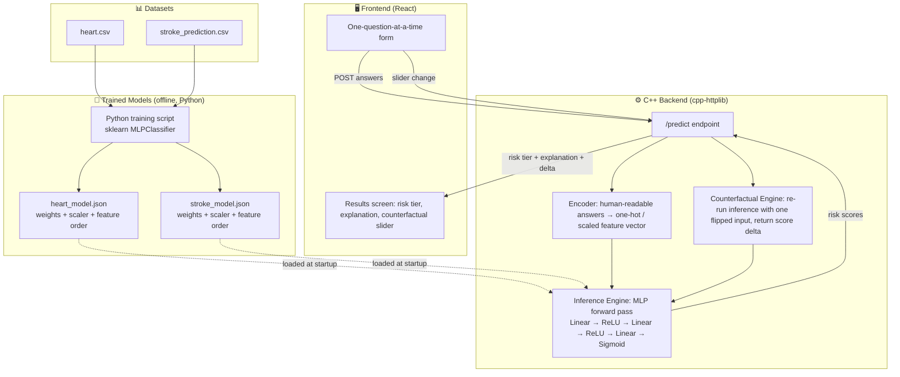

# MedflowAI
codecortex hackathon

## Heart Disease + Stroke Prediction

Neural network models trained on heart disease and stroke datasets, exported as JSON for the C++ inference backend.

### Files

| File | Description |
|---|---|
| `train_heart.py` | Trains MLP on `heart.csv`, exports `heart_model.json` |
| `train_stroke.py` | Trains MLP on `stroke_prediction.csv`, exports `stroke_prediction.json` |
| `heart_model.json` | Heart model weights — ready for C++ backend |
| `stroke_prediction.json` | Stroke model weights — ready for C++ backend |

### Model Architecture
Both models: `Input -> 64 -> 32 -> 1 (sigmoid)`

### C++ Inference (identical for both models)
```cpp
// 1. Scale: z_i = (x_i - mean_i) / scale_i
// 2. Forward pass through layers:
//    a = z
//    for each hidden layer: a = relu(W @ a + b)
// 3. Output: logit = dot(W_out, a) + b_out
// 4. prob = 1 / (1 + exp(-logit))
// 5. pred = prob >= decision_threshold
```

### Results
| Model | Accuracy |
|---|---|
| Heart Disease | **96.1%** |
| Stroke | 70% (optimised for recall -- catches 80% of real stroke cases) |

### Run
```bash
pip install pandas numpy scikit-learn
python train_heart.py        # outputs heart_model.json
python train_stroke.py       # outputs stroke_prediction.json
```
## Architecture



### Flow summary

1. **Offline (once, before the demo):** `heart.csv` and `stroke_prediction.csv` are cleaned and used to train two MLP classifiers in Python. Each model's weights, biases, and scaler parameters are exported to a JSON file (`heart_model.json`, `stroke_model.json`) — no live Python dependency at runtime.
2. **Backend startup:** the C++ server loads both JSON files once into memory.
3. **User interaction:** the React frontend asks one plain-language question at a time, sends the collected answers to `/predict`.
4. **Encoding:** the C++ encoder maps human-readable answers (e.g. `work_type: "Private"`) into the exact one-hot / scaled feature vector each model expects.
5. **Inference:** a hand-written forward pass (matrix multiply → ReLU → matrix multiply → ReLU → matrix multiply → sigmoid) runs directly in C++ — no ML runtime dependency.
6. **Response:** risk scores, tier (urgent / moderate / low), and top contributing features are returned to the frontend.
7. **Counterfactual:** when the user moves a slider (e.g. "what if BP were normal?"), the frontend re-sends the modified input, the backend re-runs inference, and returns the score delta live.

### Tech stack

| Layer | Technology | Why |
|---|---|---|
| Frontend | React | Fast to build, clean conversational UI |
| Backend | C++ (cpp-httplib + nlohmann/json) | Real-time inference latency, no Python runtime dependency in production path |
| Model training | Python (scikit-learn) | Fast iteration, exported to portable JSON — training and serving are decoupled |
| Model format | JSON (weights, scaler, feature order) | Language-agnostic, human-inspectable, easy to version |

