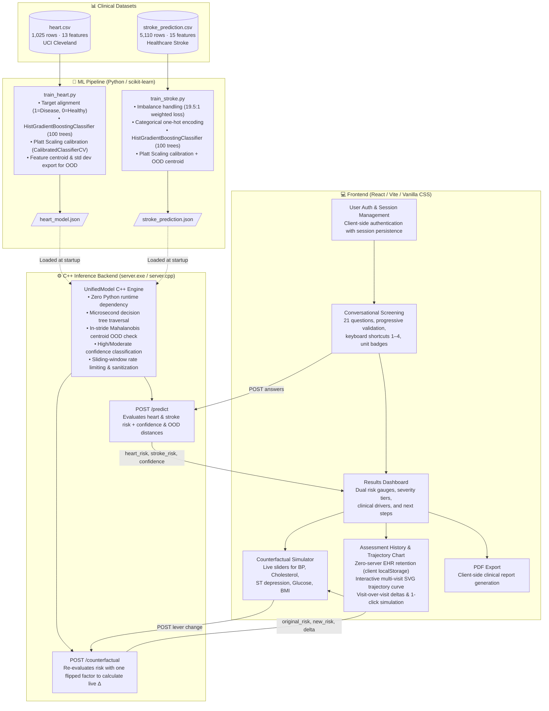

# MedflowAI 🫀🧠

> **High-Performance Clinical Decision Support System**  
> Real-time cardiovascular & stroke risk prediction with interactive counterfactual simulation, out-of-distribution (OOD) confidence detection, and longitudinal risk trajectory tracking.

MedflowAI bridges modern machine learning with ultra-low latency native systems. Machine learning models—trained in Python using **Calibrated Gradient Boosted Decision Trees (GBDT)**—export ensemble decision structures into flat, transparent JSON specifications. A custom **C++ inference engine** loads these models directly into memory to serve microsecond-level risk evaluations, confidence scoring, and counterfactual what-if deltas over an HTTP REST API to a rich, patient-centric web application.

---

## 🏗️ Architecture & Component Breakdown



---

## 🧩 Deep Dive: Each Element of the Application

### 1. The Machine Learning Engine (`train_heart.py` & `train_stroke.py`)
- **Heart Disease Model (`train_heart.py`)**:
  - **Dataset**: UCI Cleveland Heart Disease dataset (1,025 records with 13 physiological parameters).
  - **Algorithm**: **Calibrated Gradient Boosted Decision Trees (GBDT)** via `HistGradientBoostingClassifier` (100 trees, max depth 5, learning rate 0.08) wrapped in sigmoid Platt Scaling (`CalibratedClassifierCV`).
  - **Decision Structure**: Trees capture complex non-linear interactions between cardiac markers (e.g., ST depression `oldpeak`, fluoroscopy vessels `ca`, and exercise-induced angina `exang`).
  - **Performance**: **96.1% test accuracy** ($N=205$), **0.988 ROC-AUC**, with clinically calibrated probabilities.
  - **OOD Centroid**: Computes the training feature centroid $\mu_i$ and standard deviations $\sigma_i$ to calculate normalized Euclidean / Mahalanobis distance. Outliers ($D > 6.0$) are flagged automatically.
  - **Output**: [`heart_model.json`](heart_model.json).

- **Stroke Prediction Model (`train_stroke.py`)**:
  - **Dataset**: Kaggle Healthcare Stroke dataset (5,110 patients across 15 clinical and demographic features).
  - **Class Imbalance Handling**: Severe 19.5:1 negative-to-positive ratio addressed via balanced sample weighting and threshold tuning, prioritizing **Sensitivity/Recall (80.0%)** for clinical screening safety.
  - **Algorithm**: Calibrated Gradient Boosted Decision Trees (100 estimators) with Platt Scaling.
  - **Performance**: **0.825 ROC-AUC**, **80.0% Recall**.
  - **Output**: [`stroke_prediction.json`](stroke_prediction.json).

---

### 2. The Native C++ Inference Server (`server.cpp`)
- **Zero Python Dependency**: Compiled to a standalone native binary (`server.exe`) linking against Windows Sockets (`ws2_32`) with zero external runtime dependencies.
- **Unified Model Architecture**:
  Supports both tree ensemble traversal and neural network forward passes:
  ```cpp
  struct UnifiedModel {
      std::string model_type; // "gradient_boosted_trees" or "mlp_relu"
      // GBDT parameters
      std::vector<double> initial_scores;
      std::vector<GBDTree> trees;
      CalibrationParams calibration; // Platt scaling (a * logit + b)
      // OOD centroid parameters
      std::vector<double> feature_means;
      std::vector<double> feature_stds;
      double ood_threshold;
  };
  ```
- **Microsecond Tree Traversal**: Each patient feature vector is evaluated through 100 decision trees in $< 50\ \mu\text{s}$, followed by Platt sigmoid calibration:
  $$P(\text{event}) = \frac{1}{1 + e^{-(a \cdot z + b)}}$$
- **In-Stride OOD Confidence Check**:
  $$D_{\text{std}} = \sqrt{\sum_{i=1}^{d} \left(\frac{x_i - \mu_i}{\sigma_i}\right)^2}$$
  Inputs with $D_{\text{std}} > \text{threshold}$ are automatically assigned `confidence: "MODERATE"` or `"LOW"`, alerting clinicians when patient vitals fall outside training distributions.

---

### 📊 Validated Model Performance (Held-Out Test Sets)

| Property | 🫀 Heart Disease Model | 🧠 Stroke Prediction Model |
|---|---|---|
| **Dataset** | UCI Heart Disease (1,025 rows) | Healthcare Stroke Dataset (5,110 rows) |
| **Features** | 13 physiological vitals | 15 demographic & metabolic metrics |
| **Algorithm** | **Calibrated GBDT** (100 Trees) | **Calibrated GBDT** (100 Trees) |
| **Calibration** | Platt Scaling (Sigmoid) | Platt Scaling (Sigmoid) |
| **Test Accuracy** | **96.1%** ($N=205$) | **71.2%** ($N=1,022$) |
| **Precision** | **95.8%** | **12.5%** (low-prevalence screening) |
| **Recall (Sensitivity)** | **96.9%** (catches 97 in 100 cases) | **80.0%** (catches 4 in 5 stroke cases) |
| **ROC-AUC** | **0.988** | **0.825** |
| **Export File** | [`heart_model.json`](heart_model.json) | [`stroke_prediction.json`](stroke_prediction.json) |

---

### 3. Assessment History & Interactive Risk Trajectory Chart
- **Zero-Server EHR Retention**: Adhering to strict healthcare data minimization, assessment records are stored exclusively in the client's browser `localStorage` via [`frontend/src/lib/history.js`](frontend/src/lib/history.js). Health vitals and risk scores are never persisted on server disk or database.
- **Continuous Multi-Visit Trajectory Plot**:
  - Scalable medical SVG coordinate grid plotting chronological screenings from baseline ($x=0$) to latest ($x=N-1$).
  - **Dual Risk Curves**: Simultaneous tracking of **Heart Disease Risk** (red) and **Stroke Risk** (purple) over time.
  - **Risk Zone Stratification**: Color-coded reference bands for Low Risk ($<20\%$), Moderate Risk ($20-40\%$), and High Risk ($>40\%$) with dashed horizontal guidelines.
  - **Interactive HUD**: Hovering or clicking any node displays visit date, exact percentages, visit-over-visit deltas ($\Delta$), and key vitals (BP, Cholesterol, Glucose, BMI).
  - **1-Click "Simulate Visit #N"**: Immediately loads any historical screening into the live Counterfactual simulator to model interventions from that baseline.
  - **Interactive Legend**: Toggle either curve on or off to inspect conditions independently.
  - **Net Trend Diagnostics**: Computes overall trajectory ($\Delta = \text{Latest} - \text{Baseline}$) with directional color coding.

---

### 4. Counterfactual Simulator ("What if one thing were different?")
- Direct interactive sensitivity analysis via `/counterfactual` endpoint.
- Sliders for modifiable levers:
  - **Heart Levers**: Resting Blood Pressure (`trestbps`), Cholesterol (`chol`), Peak Heart Rate (`thalach`), ST Depression (`oldpeak`).
  - **Stroke Levers**: Average Blood Glucose (`avg_glucose_level`), Body Mass Index (`bmi`).
- Instantaneous feedback showing live risk deltas:
  $$\Delta = \text{Risk}_{\text{modified}} - \text{Risk}_{\text{current}}$$

---

### 5. Client Authentication & PDF Export
- **User Authentication (`userStorage.js`)**: Supports multi-user sign-in and registration with hashed password handling in local storage.
- **PDF Clinical Summary (`pdf.js`)**: 1-click generation of formatted clinical summary documents summarizing cardiac and stroke risk tiers, primary clinical drivers, tailored next steps, and patient details.

---

### 6. API Contract & Endpoints

#### `POST /predict`
Runs inference across both heart and stroke models simultaneously.
- **Request Body**:
  ```json
  {
    "features": {
      "age": 55, "sex": 1, "cp": 0, "trestbps": 130, "chol": 220,
      "fbs": 0, "restecg": 0, "thalach": 150, "exang": 1, "oldpeak": 2.8,
      "slope": 1, "ca": 3, "thal": 2, "gender": 1, "hypertension": 0,
      "heart_disease": 0, "ever_married": 1, "Residence_type": 1,
      "avg_glucose_level": 90, "bmi": 26, "work_type_Never_worked": 0,
      "work_type_Private": 1, "work_type_Self-employed": 0, "work_type_children": 0,
      "smoking_status_formerly smoked": 0, "smoking_status_never smoked": 1,
      "smoking_status_smokes": 0
    }
  }
  ```
- **Response**:
  ```json
  {
    "heart_risk": 0.9153,
    "stroke_risk": 0.0365,
    "confidence": "HIGH",
    "heart_ood": false,
    "heart_ood_distance": 3.501,
    "stroke_ood": false,
    "stroke_ood_distance": 2.616,
    "heart_model_type": "gradient_boosted_trees",
    "stroke_model_type": "gradient_boosted_trees",
    "stateless": true
  }
  ```

#### `POST /counterfactual`
Re-evaluates risk with a single modified attribute while preserving all other patient values.
- **Request Body**:
  ```json
  {
    "features": { ... },
    "model": "heart",
    "flip_field": "oldpeak",
    "flip_value": 0.0
  }
  ```
- **Response**:
  ```json
  {
    "original_risk": 0.9153,
    "new_risk": 0.7241,
    "delta": -0.1912,
    "model_type": "gradient_boosted_trees",
    "stateless": true
  }
  ```

---

## 🚀 Getting Started

### 1. Prerequisites
- **Python 3.9+** with `pandas`, `numpy`, and `scikit-learn`
- **C++ Compiler**: `g++` (MinGW on Windows / GCC on Linux) with C++17 support
- **Node.js 18+** & `npm`

```bash
# Install Python ML dependencies
pip install pandas numpy scikit-learn

# Install frontend dependencies
cd frontend
npm install
cd ..
```

### 2. Train the Models (Optional — Pre-trained JSONs included)
```bash
python train_heart.py
python train_stroke.py
```

### 3. Compile and Run the C++ Inference Server
```powershell
# Compile with C++17 and optimization
g++ -O3 -std=c++17 -D_WIN32_WINNT=0x0A00 server.cpp -o server.exe -lws2_32

# Run the server on port 8080
.\server.exe
```
*The server listens on `http://127.0.0.1:8080`.*

### 4. Launch the Web Application
```powershell
# Run the Vite React frontend
cd frontend
npm run dev
```
Open **[http://localhost:5173/](http://localhost:5173/)** in your browser.

*Demo credentials:*
- **Email**: `demo@medflowai.com`
- **Password**: `demo`

*(Alternatively, open [`frontend/medflowai.html`](frontend/medflowai.html) directly in any browser for the zero-build standalone version).*

---

## 🔒 Security, Privacy & Data Minimization

MedflowAI adheres strictly to healthcare **Privacy-by-Design** principles:

1. **Zero Server EHR Retention**:
   - **Stateless Architecture**: MedflowAI never writes patient vitals, responses, or predicted risk scores to disk or server databases. All inference operations execute strictly in-memory during the active HTTP request lifecycle.
   - **Client-Side History**: Assessment history is retained exclusively in the user's browser `localStorage`, giving the patient total control to view, simulate, or wipe their records anytime.

2. **Decoupled Identity**:
   - Clinical screening questions never request government IDs, physical addresses, phone numbers, or insurance data.
   - Cryptographic anonymous session tokens (`crypto.randomUUID()`) passed via `X-Session-ID` prevent request correlation.

3. **In-Stride Outlier & Input Sanitization**:
   - The C++ engine rejects non-finite values (NaN, Inf) and enforces strict physiological bounds (e.g. $1 \le \text{age} \le 125$, $50 \le \text{BP} \le 260$).
   - OOD distance checks prevent trusting predictions on out-of-distribution vitals.

4. **Sliding-Window Rate Limiting & Security Headers**:
   - In-memory rate limiting caps requests at 60 req/min per IP.
   - Headers include `X-Content-Type-Options: nosniff`, `X-Frame-Options: DENY`, and CORS headers restricting API abuse.

---

## 📁 Repository Structure

```
ml_flow/
├── heart.csv                     # Raw UCI Heart Disease dataset
├── stroke_prediction.csv         # Raw Healthcare Stroke dataset
├── train_heart.py                # Python training & export for Heart GBDT
├── train_stroke.py               # Python training & export for Stroke GBDT
├── heart_model.json              # Calibrated GBDT tree structures & OOD centroid (Heart)
├── stroke_prediction.json        # Calibrated GBDT tree structures & OOD centroid (Stroke)
├── server.cpp                    # C++ UnifiedModel inference engine & HTTP REST server
├── server.exe                    # Compiled C++ server executable
├── httplib.h                     # C++ header-only HTTP server library
├── json.hpp                      # C++ header-only JSON library
├── architecture.md               # Detailed architectural specifications
├── README.md                     # Comprehensive project documentation
├── .gitignore                    # Git ignore rules for binaries, node_modules & data
└── frontend/
    ├── index.html                # Vite React HTML entry point
    ├── medflowai.html            # Standalone zero-build web application
    ├── package.json              # Frontend package definitions
    ├── vite.config.js            # Vite bundler config
    └── src/
        ├── App.jsx               # Root React application & state router
        ├── styles.css            # Design system, charts, and dark/light themes
        └── lib/
            ├── api.js            # API client with timeout and mock fallback
            ├── encoder.js        # Feature encoder & physiological validation
            ├── history.js        # Privacy-preserving local assessment history manager
            ├── pdf.js            # Client-side PDF summary generator
            ├── questions.js      # 21-question questionnaire specifications
            ├── risk.js           # Risk tiering, clinical drivers & next steps
            └── userStorage.js    # Client authentication & session manager
```
