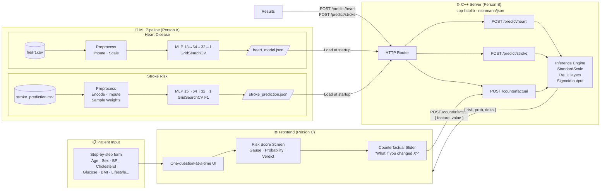
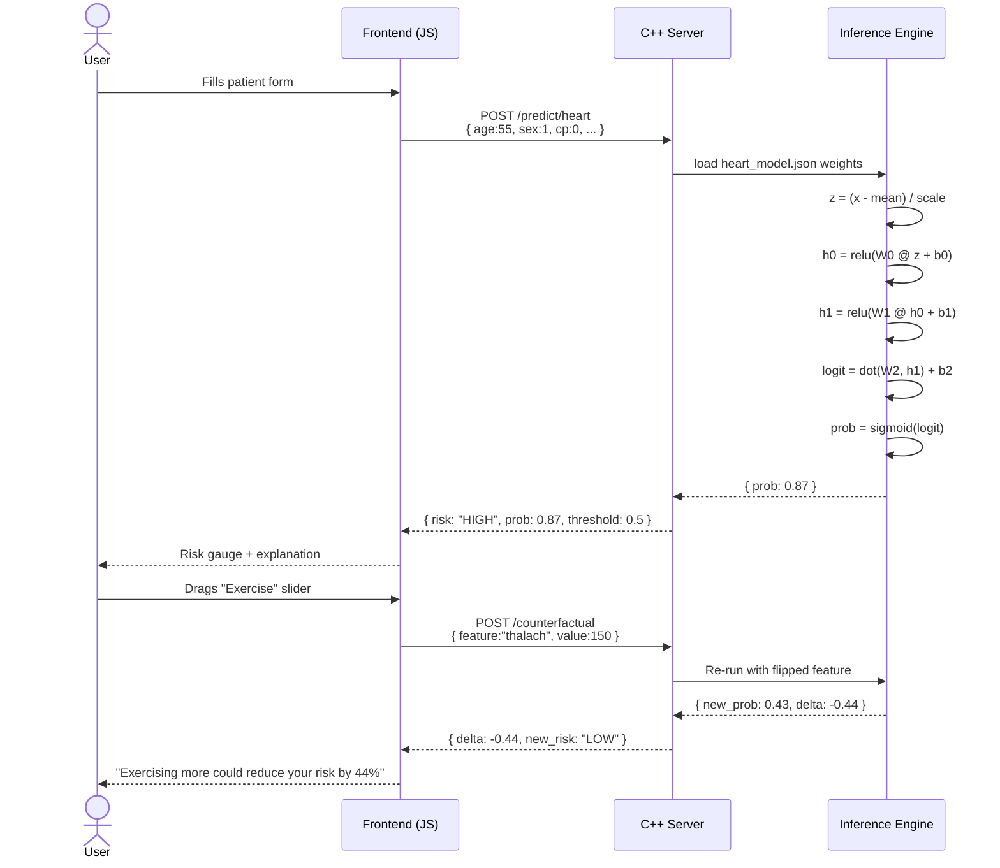

# MedflowAI — System Architecture

## Full Stack Overview



---

## Data Flow — Single Prediction



---

## Neural Network Architecture (Both Models)

```mermaid
graph LR
    subgraph Input["Input Layer"]
        I1["x₁"]
        I2["x₂"]
        I3["..."]
        IN["xₙ"]
    end

    subgraph Scale["StandardScaler"]
        S["z = (x - μ) / σ"]
    end

    subgraph H1["Hidden Layer 1 · 64 neurons"]
        H1A["ReLU"]
        H1B["ReLU"]
        H1C["..."]
        H1D["ReLU"]
    end

    subgraph H2["Hidden Layer 2 · 32 neurons"]
        H2A["ReLU"]
        H2B["ReLU"]
        H2C["..."]
        H2D["ReLU"]
    end

    subgraph Output["Output"]
        O["sigmoid(logit)"]
        PRED["pred ≥ 0.5 ?"]
    end

    Input --> Scale --> H1 --> H2 --> O --> PRED
```



| Layer | Operation | Shape (Heart) | Shape (Stroke) |
|---|---|---|---|
| Input | Raw features | `(13,)` | `(15,)` |
| StandardScaler | `z = (x−μ)/σ` | `(13,)` | `(15,)` |
| Hidden 1 | `relu(W₁z + b₁)` | `W: (64×13)` | `W: (64×15)` |
| Hidden 2 | `relu(W₂h + b₂)` | `W: (32×64)` | `W: (32×64)` |
| Output | `sigmoid(W₃h + b₃)` | `W: (1×32)` | `W: (1×32)` |

---

## JSON Schema (shared by both models)

```
heart_model.json / stroke_prediction.json
├── model            "mlp_relu"
├── architecture     "13 -> 64 -> 32 -> 1"
├── decision_threshold  0.5
├── feature_names    ["age", "sex", ...]      ← ORDER MATTERS for C++
├── scaler
│   ├── type         "standard"
│   ├── mean         [54.6, 0.69, ...]        ← per feature, same order
│   └── scale        [9.09, 0.46, ...]
├── layers
│   ├── [0]  activation:"relu"    W:(64×13)  b:(64,)
│   ├── [1]  activation:"relu"    W:(32×64)  b:(32,)
│   └── [2]  activation:"sigmoid" W:(1×32)   b:scalar
└── test_metrics
    └── accuracy     0.961
```

---

## Model Performance

### Heart Disease (`heart_model.json`)
```
Accuracy:  96.1%

              precision  recall  f1
No Disease      0.96     0.96   0.96   (100 samples)
Disease         0.96     0.96   0.96   (105 samples)

Confusion Matrix:
          Pred 0   Pred 1
Actual 0    96       4
Actual 1     4     101
```

### Stroke (`stroke_prediction.json`)
```
Tuned for RECALL (class imbalance 19.5:1)

              precision  recall  f1
No Stroke       0.99     0.69   0.81   (972 samples)
Stroke          0.12     0.80   0.21   ( 50 samples)

Stroke recall: 80% — catches 4 of every 5 real stroke patients.
Lower threshold (e.g. 0.3) in JSON to increase recall further.
```

---

## C++ Pseudo-code

```cpp
#include <nlohmann/json.hpp>
#include <cmath>
#include <vector>

// Load once at startup
auto model = nlohmann::json::parse(std::ifstream("heart_model.json"));

double relu(double x) { return x > 0 ? x : 0; }
double sigmoid(double x) { return 1.0 / (1.0 + std::exp(-x)); }

double predict(std::vector<double> x) {
    auto& scaler = model["scaler"];
    auto& layers = model["layers"];

    // 1. StandardScale
    for (int i = 0; i < x.size(); i++)
        x[i] = (x[i] - scaler["mean"][i].get<double>())
                     / scaler["scale"][i].get<double>();

    // 2. Forward pass
    std::vector<double> a = x;
    for (auto& layer : layers) {
        std::vector<double> out;
        auto W = layer["W"].get<std::vector<std::vector<double>>>();
        auto b = layer["b"];
        bool is_output = (layer["activation"] == "sigmoid");

        for (int j = 0; j < W.size(); j++) {
            double pre = (is_output ? b.get<double>()
                                    : b[j].get<double>());
            for (int k = 0; k < a.size(); k++)
                pre += W[j][k] * a[k];
            out.push_back(is_output ? sigmoid(pre) : relu(pre));
        }
        a = out;
    }
    return a[0];   // probability [0, 1]
}
```
